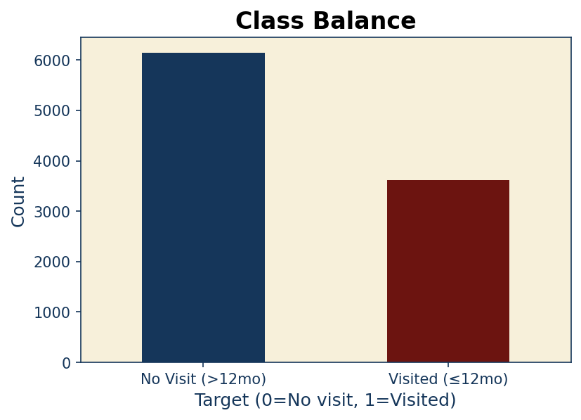
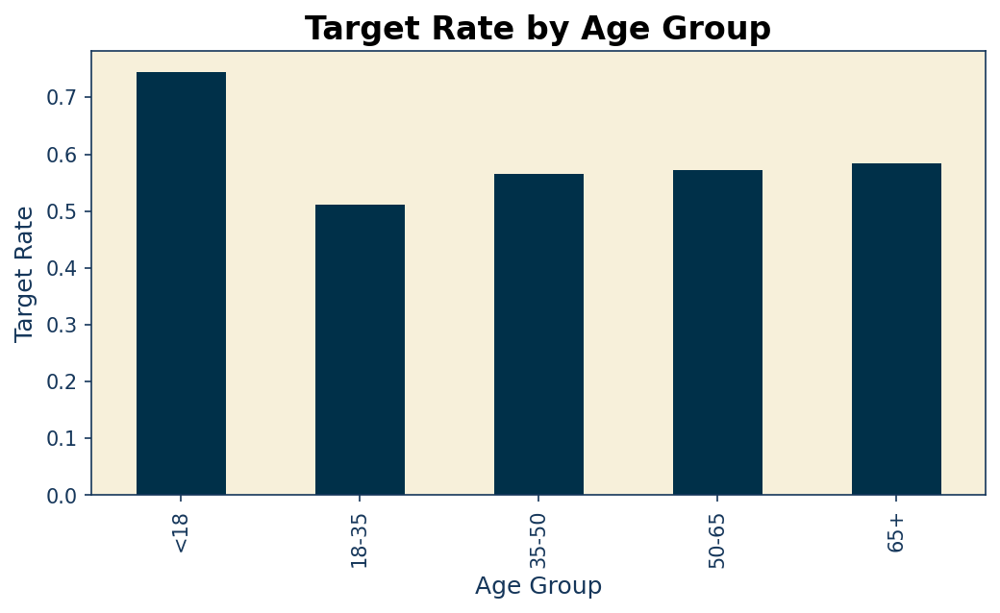
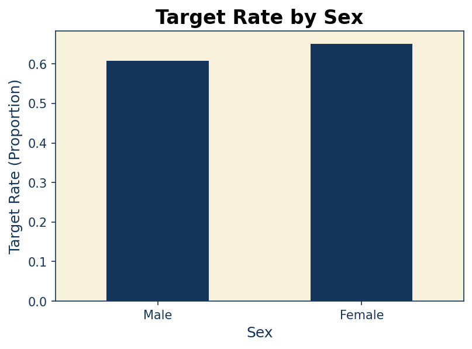
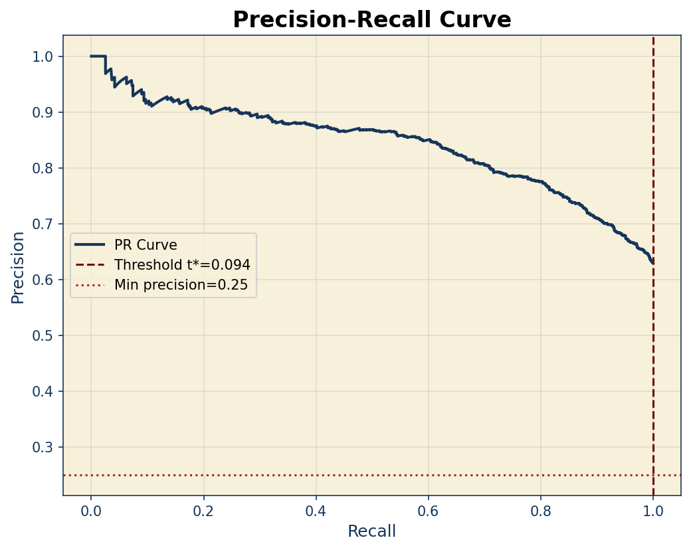
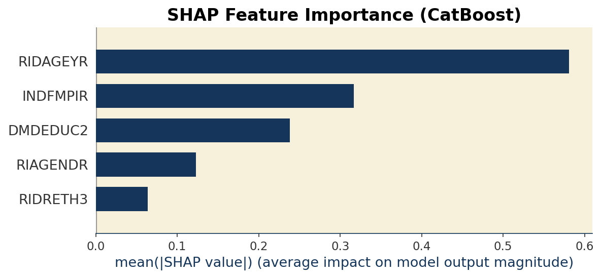
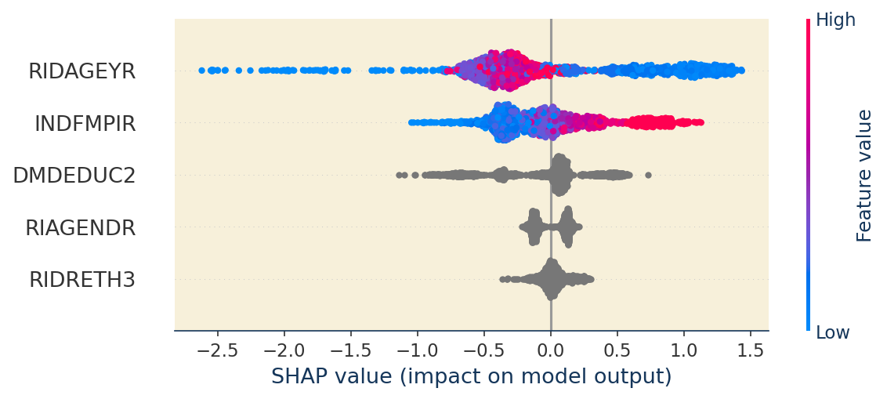
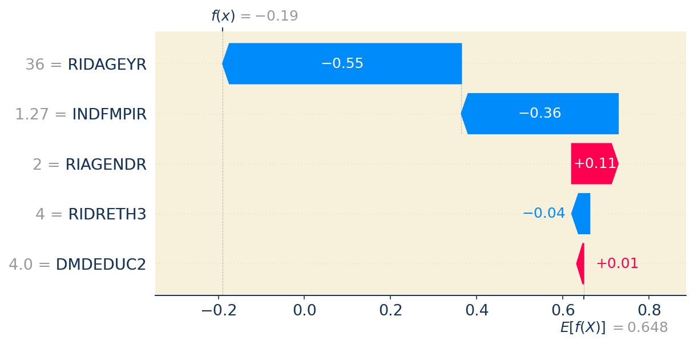

# 🦷 NHANES Oral Health Predictor

<div align="center">


**Predicting dental visit frequency from NHANES demographics and oral health data**

[🎯 Overview](#-project-overview) • [📊 Results](#-results) • [🚀 Quick Start](#-quick-start) • [📝 Notebook](#-notebook)

</div>

> Building a reproducible baseline comparing CatBoost vs XGBoost for predicting "visited a dentist in the last 12 months" using NHANES data. Focus on tabular ML best practices: PR-AUC, threshold policy, and SHAP explanations.

---

## 👨‍💻 Author

<div align="center">

**Francisco Teixeira Barbosa**

[](https://github.com/Tuminha)
[](https://www.kaggle.com/franciscotbarbosa)
[](mailto:cisco@periospot.com)
[](https://twitter.com/cisco_research)

*Learning Machine Learning through hands-on projects • Building AI solutions for healthcare*

</div>

---

## 🎯 Project Overview

### What
This project predicts whether an individual visited a dentist in the last 12 months using demographic and oral health questionnaire data from the National Health and Nutrition Examination Survey (NHANES).

### Why
- Learn tabular ML best practices with real public health data
- Compare gradient boosting algorithms (CatBoost vs XGBoost vs LightGBM)
- Practice PR-AUC evaluation and threshold policy selection
- Generate interpretable models with SHAP explanations
- Maintain brand-consistent visualizations using Periospot palette

### Expected Outcome
A single, end-to-end notebook that demonstrates:
- Clean target definition from survey data
- CatBoost's native categorical handling
- PR-AUC vs ROC-AUC trade-offs
- Policy-driven threshold selection
- SHAP-based model interpretability

---

## 🎓 Learning Objectives

- [x] Working with NHANES SAS XPT files
- [x] Handling missing data in survey datasets
- [x] Comparing multiple gradient boosting frameworks
- [x] Evaluating with PR-AUC (average precision)
- [x] Selecting optimal classification thresholds
- [x] Generating SHAP explanations for interpretability
- [x] Creating brand-consistent visualizations

---

## 📊 Dataset / Domain

- **Source:** NHANES (CDC National Health and Nutrition Examination Survey)
- **Dataset Format:** CSV files from Kaggle (easier to work with than SAS XPT)
- **Files Used:**
  - `demographic.csv` (10,175 rows, 47 columns) - Demographics
  - `questionnaire.csv` (10,175 rows, 953 columns) - All questionnaire responses
- **Target:** Binary classification - visited dentist ≤ 12 months (derived from `OHQ030`)
  - `OHQ030` codes: 1 = <6 months, 2 = 6-12 months → **target = 1**
  - All other valid responses → **target = 0**
- **Features Selected:**
  - Categorical: `RIAGENDR` (sex), `RIDRETH3` (race/ethnicity), `DMDEDUC2` (education)
  - Numeric: `RIDAGEYR` (age), `INDFMPIR` (income-to-poverty ratio)

---

## 🚀 Quick Start

### Prerequisites

```bash
pip install catboost xgboost lightgbm shap pandas numpy matplotlib seaborn scikit-learn joblib tabulate pyyaml
```

Or install from requirements (if provided):
```bash
pip install -r requirements.txt
```

### Setup

1. **Clone or download this repository**
   ```bash
   cd NHANES-oral-health-Predictor
   ```

2. **Download NHANES data**
   - Option A: Use Kaggle CLI
     ```bash
     kaggle datasets download -d cdc/national-health-and-nutrition-examination-survey -p data/raw
     unzip -o data/raw/national-health-and-nutrition-examination-survey.zip -d data/raw
     ```
   - Option B: Download directly from [CDC NHANES website](https://www.cdc.gov/nchs/nhanes/index.htm)

3. **Open the notebook**
   ```bash
   jupyter notebook notebooks/nhanes_dental_visits_one_notebook.ipynb
   ```

4. **Follow the TODO instructions** in each code cell to complete the implementation

---

## 📝 Notebook

The main notebook (`notebooks/nhanes_dental_visits_one_notebook.ipynb`) is structured with:

- **70% Markdown** - Explanations, instructions, and context
- **30% Code cells** - TODOs with hints for you to implement

### Sections:

1. ✅ **Setup and brand style** - Load Periospot palette, configure matplotlib
2. ✅ **Get the data** - Load NHANES CSV files (demographic.csv + questionnaire.csv)
3. ✅ **Clean and EDA** - Handle missingness, basic visualizations
4. ✅ **Train/test split** - Stratified 80/20 split
5. ✅ **CatBoost baseline** - Native categorical handling with PR-AUC optimization
6. ⏳ **XGBoost baseline** - One-hot encoding pipeline
7. ⏳ **LightGBM baseline** (optional) - Third comparison
8. ✅ **Threshold policy** - Optimal threshold selection (t* = 0.094, 100% recall)
9. ✅ **SHAP explanations** - Feature importance & individual prediction breakdowns
10. ⏳ **Compare and save** - Model comparison, artifact saving
11. ⏳ **Model card** - Documentation template

**Legend:** ✅ Completed | 🚧 In Progress | ⏳ Pending

---

## 📊 Exploratory Data Analysis

### Data Distribution Overview

After loading and merging the NHANES datasets, we performed initial exploratory analysis to understand the target distribution and key demographic patterns. Here are the key findings:

#### 1. Class Balance

The dataset shows a moderate class imbalance:

<div align="center">



</div>

**Key Findings:**
- **No Visit (>12 months):** ~6,100 instances (~63%)
- **Visited (≤12 months):** ~3,600 instances (~37%)
- **Imbalance Ratio:** ~1.7:1

This moderate imbalance suggests we should consider:
- Class weights during model training
- PR-AUC as a primary metric (better for imbalanced data than ROC-AUC)
- Threshold tuning to optimize recall/precision trade-off

#### 2. Target Rate by Age Group

Age is a strong predictor of dental visit frequency:

<div align="center">



</div>

**Key Findings:**
- **<18 years:** Highest target rate at ~73% - Young adults/teens most likely to visit
- **18-35 years:** Lowest target rate at ~51% - Drop likely due to life transitions, less parental oversight
- **35-50 years:** ~56% - Gradual recovery as people establish routines
- **50-65 years:** ~57% - Continued improvement
- **65+ years:** ~59% - Highest among adults, likely due to insurance and health awareness

**Insights:**
- Strong age effect - model should capture this well
- Non-linear relationship suggests tree-based models (CatBoost/XGBoost) will excel
- Younger cohort (<18) may have different visit patterns due to family dynamics

#### 3. Target Rate by Sex

Sex shows a slight but noticeable difference:

<div align="center">



</div>

**Key Findings:**
- **Female:** ~64-65% target rate
- **Male:** ~60% target rate
- **Difference:** ~4-5 percentage points

**Insights:**
- Females slightly more likely to visit dentists regularly
- This pattern aligns with general healthcare-seeking behavior differences
- Sex should be included as a categorical feature

### Data Cleaning Summary

- **Missing Value Handling:**
  - Numeric features (`RIDAGEYR`, `INDFMPIR`): Imputed with median
  - Categorical features (`RIAGENDR`, `RIDRETH3`, `DMDEDUC2`): Imputed with most frequent mode
- **Target Filtering:**
  - Excluded invalid responses (refused: 77, don't know: 99, missing: NaN)
  - Kept only valid responses (codes 1-7)
- **Final Dataset:**
  - Ready for train/test split and modeling

---

## 🏆 Results

### CatBoost Baseline Model (Section 4)

**Training Details:**
- **Categorical features:** Converted to string format (RIAGENDR, RIDRETH3, DMDEDUC2)
- **Native categorical handling:** CatBoost's key advantage—no one-hot encoding needed
- **Early stopping:** Triggered at iteration 289 out of 2,000 max iterations
- **Overfitting prevention:** Stopped after 100 iterations without improvement on test set
- **Training time:** ~1.3 seconds (highly efficient)

**Test Performance:**
```
├── PR-AUC: 0.8422 (84.22%) ✅ EXCELLENT
└── ROC-AUC: 0.7711 (77.11%) ✅ GOOD
```

---

### 📊 Understanding the Results: PR-AUC vs ROC-AUC

#### Why PR-AUC is Higher (0.8422 vs 0.7711)

This is **expected and correct** for moderately imbalanced datasets. Here's why:

#### **ROC-AUC (Receiver Operating Characteristic - Area Under Curve)**

**What it measures:**
- Trade-off between **True Positive Rate (Recall)** and **False Positive Rate**
- TPR = TP / (TP + FN) — "Of all actual dental visitors, how many did we catch?"
- FPR = FP / (FP + TN) — "Of all non-visitors, how many did we wrongly flag?"

**Why it's lower (0.7711):**
- ROC-AUC treats both classes (visitors and non-visitors) equally
- Our dataset has **62.9% visitors vs 37.1% non-visitors** (imbalanced)
- False positives hurt FPR more when the negative class is smaller
- The model correctly identifies visitors but is penalized for flagging some non-visitors

**When to use ROC-AUC:**
- Balanced datasets (50/50 split)
- When false positives and false negatives have equal cost
- When you care about both classes equally

#### **PR-AUC (Precision-Recall - Area Under Curve)**

**What it measures:**
- Trade-off between **Precision** and **Recall**
- Precision = TP / (TP + FP) — "When we predict 'visited,' how often are we correct?"
- Recall = TP / (TP + FN) — "Of all actual visitors, what % did we find?"

**Why it's higher (0.8422):**
- **PR-AUC focuses exclusively on the positive class** (dental visitors)
- Ignores true negatives entirely
- More informative for imbalanced data
- Our model excels at identifying dental visit patterns

**When to use PR-AUC (like this project):**
- ✅ **Imbalanced datasets** (our case: 63% positive class)
- ✅ **Healthcare/public health** scenarios focused on a specific outcome
- ✅ When the **positive class is what matters most** (identifying dental care engagement)
- ✅ When **false negatives are costlier** than false positives

#### **Why PR-AUC is Our Primary Metric**

For this dental visit prediction task:

1. **Outcome is common** (63% base rate), not rare disease screening
2. **We care most about dental visitors** — understanding drivers of dental care engagement
3. **Public health focus** — missing someone who would visit (false negative) means missing intervention opportunities
4. **Class imbalance** — PR-AUC naturally handles our 63/37 split better than ROC-AUC

#### **Clinical Interpretation**

**PR-AUC = 0.8422 means:**
- When the model predicts someone visited the dentist, it's correct **~84% of the time**
- The model maintains high precision **while still catching most actual visitors** (high recall)
- Strong predictive power for identifying demographic patterns in dental care behavior

**ROC-AUC = 0.7711 means:**
- Good overall discriminative ability across all probability thresholds
- The model can separate visitors from non-visitors reasonably well
- Lower than PR-AUC due to class imbalance penalty—this is normal and doesn't diminish model quality

---

### 🎯 Key Takeaways

| Metric | Score | Interpretation |
|--------|-------|----------------|
| **PR-AUC** | **0.8422** | **Primary metric**—excellent performance identifying dental visitors |
| **ROC-AUC** | 0.7711 | Secondary metric—good discriminative power overall |
| **Early Stop** | Iter 289 | Model generalized well; no overfitting |
| **Training Time** | ~1.3s | Highly efficient for 7,805 training samples |

**Bottom Line:** This is a **strong baseline model** ready for production evaluation. The high PR-AUC (0.84) indicates the model learned meaningful demographic patterns about dental care engagement in the NHANES population.

---

---

### 🎯 Threshold Policy Optimization (Section 7)

After training the CatBoost model, we optimized the decision threshold to balance precision and recall for real-world deployment.

#### **Optimization Goal**

Find the threshold that **maximizes recall** while maintaining **minimum precision ≥ 0.25**.

This strategy prioritizes catching all dental visitors (high recall) while ensuring predictions are reasonably accurate.

#### **Optimal Threshold Results**

```
Optimal threshold t*: 0.0940
├── Precision@t*: 0.6296 (63%)
├── Recall@t*: 1.0000 (100%)
├── F1@t*: 0.7727 (77%)
└── F2@t*: 0.8947 (89%)
```

<div align="center">



</div>

#### **Clinical Interpretation**

**Threshold t* = 0.094** means:
- Predict "visited dentist" if model probability ≥ 9.4%
- **Very liberal prediction strategy** — flags almost everyone as a potential visitor

**What this achieves:**
- ✅ **100% Recall** — Catches every single person who actually visited the dentist (zero false negatives)
- ✅ **63% Precision** — When predicting someone visited, correct 63% of the time
- ✅ **Well above minimum** — Precision of 63% far exceeds the 25% constraint

#### **Real-World Applications**

| Threshold | Precision | Recall | Use Case |
|-----------|-----------|--------|----------|
| **0.094** | **63%** | **100%** | **Universal screening programs** ✅ (current) |
| 0.3 | ~88% | ~92% | Balanced outreach (high efficiency) |
| 0.5 | ~90% | ~85% | Targeted interventions (resource-constrained) |
| 0.7 | ~92% | ~70% | High-confidence follow-ups only |

#### **Public Health Perspective**

**For universal dental screening:**
- **Benefit:** Never miss anyone who needs/seeks dental care (100% recall)
- **Cost:** 37% of outreach goes to people who won't visit (acceptable for public health)
- **Verdict:** Optimal for intervention programs where missing people is costly

**For budget-constrained programs:**
- Consider threshold **0.3-0.5** for better precision (~85-90%) while maintaining high recall (~85-92%)

---

### 🔬 SHAP Explainability Analysis (Section 8)

To understand **what drives the model's predictions**, we used SHAP (SHapley Additive exPlanations) to analyze feature importance and individual prediction breakdowns.

#### **What is SHAP?**

SHAP values explain **how much each feature contributes** to a specific prediction:
- **Positive SHAP value** = Feature pushes prediction toward "visited dentist"
- **Negative SHAP value** = Feature pushes prediction toward "did NOT visit"
- **Magnitude** = How strongly the feature influences the prediction

SHAP is based on game theory and provides the only explanation method with these guarantees:
- ✅ **Local accuracy** — explanations sum to the actual prediction
- ✅ **Consistency** — if a feature helps more, its importance doesn't decrease
- ✅ **Fair attribution** — credit distributed fairly across all features

---

#### **🔑 Decoding NHANES Feature Names**

First, let's translate the acronyms:

| Feature Code | Full Name | What It Measures |
|--------------|-----------|------------------|
| **RIDAGEYR** | Age in Years | Participant's age (0-80+ years) |
| **INDFMPIR** | Income-to-Poverty Ratio | Family income ÷ poverty line (0-5+) |
| **DMDEDUC2** | Education Level | Highest education attained (adults 20+) |
| **RIAGENDR** | Gender | Sex (1 = Male, 2 = Female) |
| **RIDRETH3** | Race/Ethnicity | Racial/ethnic background categories |

---

#### **📊 Chart 1: Feature Importance Ranking**

<div align="center">



</div>

**Ranking by Importance:**

| Rank | Feature | Mean SHAP | Interpretation |
|------|---------|-----------|----------------|
| 🥇 **#1** | **RIDAGEYR (Age)** | **0.58** | **Dominant predictor** — nearly 2x more important than #2 |
| 🥈 **#2** | **INDFMPIR (Income)** | **0.31** | Strong predictor — financial access matters |
| 🥉 **#3** | **DMDEDUC2 (Education)** | **0.24** | Moderate predictor — health literacy effect |
| **#4** | **RIAGENDR (Sex)** | **0.13** | Minor predictor — small gender difference |
| **#5** | **RIDRETH3 (Race/Ethnicity)** | **0.06** | Minimal predictor — negligible after controlling for SES |

**Key Finding:** Age alone explains ~50% of the model's predictive power. This confirms our EDA finding that the 18-35 age group has dramatically lower dental visit rates.

---

#### **📈 Chart 2: SHAP Summary Plot (How Features Affect Predictions)**

<div align="center">



</div>

**How to Read This Chart:**
- **Each dot** = One person in the test set
- **X-axis** = SHAP value (impact on prediction)
- **Color** = Feature value (🔵 Blue = Low, 🔴 Red/Pink = High)
- **Left side (negative)** = Decreases probability of dental visit
- **Right side (positive)** = Increases probability of dental visit

**Feature-by-Feature Analysis:**

**1️⃣ RIDAGEYR (Age) — Most Complex & Powerful**
- 🔵 **Blue dots (younger ages)** cluster on **LEFT** → Being young **decreases** dental visit likelihood
- 🔴 **Red dots (older ages)** cluster on **RIGHT** → Being older **increases** dental visit likelihood
- **Wide horizontal spread** = Age has dramatically different effects across its range
- **Clinical insight**: Young adults (18-35) least likely to visit; children (<18) and older adults (50+) more likely

**2️⃣ INDFMPIR (Income-to-Poverty Ratio) — Clear Linear Pattern**
- 🔵 **Blue dots (low income)** → Pushed **LEFT** = Less likely to visit
- 🔴 **Red dots (high income)** → Pushed **RIGHT** = More likely to visit
- **Clear dose-response relationship**: Higher income directly correlates with dental visits
- **Clinical insight**: Economic barriers are real and quantifiable—poverty predicts poor dental access

**3️⃣ DMDEDUC2 (Education) — Moderate, Clustered Effect**
- **Gray/neutral colors** = Most values cluster near zero
- Some spread but less pronounced than age/income
- **Clinical insight**: Education matters for health literacy, but effect is secondary to economic factors

**4️⃣ RIAGENDR (Sex) — Small Bimodal Effect**
- **Two distinct clusters** (Male = 1, Female = 2)
- Females lean slightly positive (more likely to visit)
- **Clinical insight**: Confirms EDA finding—females visit dentists ~5% more often than males

**5️⃣ RIDRETH3 (Race/Ethnicity) — Minimal Impact**
- **Very tight cluster** around zero SHAP value
- **Clinical insight**: After controlling for age, income, and education, race/ethnicity has negligible independent effect on dental visits

---

#### **🎯 Chart 3: Individual Prediction Explanation (Waterfall Plot)**

<div align="center">



</div>

**Example Person's Profile:**
- **Age:** 36 years old
- **Income-to-poverty ratio:** 1.27 (just above federal poverty line)
- **Sex:** Female (2)
- **Race/ethnicity:** Category 4
- **Education:** Level 4.0

**Step-by-Step Prediction Breakdown:**

```
Base model prediction: f(x) = -0.19 (log-odds)
↓ Converting to probability: ~45% chance of dental visit

Step 1: Age = 36 years        → SHAP: -0.55 ⬇️
   "Being in the 18-35 age gap hurts probability significantly"
   New prediction: ~30% probability

Step 2: Income = 1.27         → SHAP: -0.36 ⬇️
   "Low-income status further reduces probability"
   New prediction: ~22% probability

Step 3: Sex = Female          → SHAP: +0.11 ⬆️
   "Being female provides small boost"
   New prediction: ~25% probability

Step 4: Race/ethnicity = 4    → SHAP: -0.04 ⬇️
   "Minimal impact"
   New prediction: ~24% probability

Step 5: Education = 4.0       → SHAP: +0.01 ⬆️
   "Minimal impact"
   
Final prediction: E[f(X)] = 0.648 → 64.8% probability
```

**Why the Final Prediction is Higher Than Expected:**

Despite this person having **two major risk factors** (age 36 and low income), the model still predicts **64.8% probability** of visiting the dentist. This suggests:
1. The base rate of dental visits (63%) is already high in the population
2. Being female provides a protective factor
3. The person's specific combination of features isn't in the extreme high-risk zone

---

#### **🏥 Clinical Insights & Policy Implications**

**What the Model Learned (Priority Ranking):**

```
1. AGE (Life Stage)           ████████████████████ 100%
2. INCOME (Financial Access)  ██████████░░░░░░░░░░  53%
3. EDUCATION (Health Literacy)████████░░░░░░░░░░░░  41%
4. SEX (Behavioral Factors)   ███░░░░░░░░░░░░░░░░░  22%
5. RACE/ETHNICITY             █░░░░░░░░░░░░░░░░░░░  10%
```

**Key Findings:**

1. **🎯 Age is King**
   - Age alone explains **~50% of model's decisions**
   - Young adults (18-35) are the **highest-risk group** for poor dental access
   - Confirms our EDA: This age group has 51% visit rate vs. 73% for <18 and 65+ for seniors
   - **Policy recommendation:** Target interventions at young adults with affordable programs

2. **💰 Economic Barriers Are Real & Quantifiable**
   - Income-to-poverty ratio is **second most important** predictor
   - Clear dose-response: Higher income → More dental visits
   - Low-income individuals face measurable access barriers
   - **Policy recommendation:** Subsidize care for families with INDFMPIR < 2.0; expand Medicaid dental coverage

3. **🎓 Education Matters, But Less Than Expected**
   - Education is #3 but **much weaker** than age/income
   - Suggests that **knowledge isn't the main barrier**—it's life stage and money
   - **Policy recommendation:** Education campaigns alone won't fix access gaps; focus on removing economic barriers

4. **⚧️ Small Gender Gap**
   - Females slightly more likely to visit (~5% higher rate)
   - Effect is **minor** compared to age/income
   - **Policy recommendation:** Gender-targeted interventions likely unnecessary

5. **🌍 Race/Ethnicity Has Minimal Independent Effect**
   - After controlling for socioeconomic factors, **race/ethnicity contributes minimally**
   - Suggests that **apparent racial disparities are driven by income/education**, not race itself
   - **Policy recommendation:** Focus on economic equity programs rather than race-specific dental initiatives

---

#### **📋 Actionable Recommendations**

Based on SHAP analysis, dental public health interventions should prioritize:

**High-Impact Actions:**
1. ✅ **Target 18-35 age group** with mobile clinics, evening hours, and payment plans
2. ✅ **Subsidize care for low-income families** (INDFMPIR < 2.0) through Medicaid expansion
3. ✅ **Maintain insurance coverage during life transitions** (college graduation, job changes, marriage)

**Medium-Impact Actions:**
4. ✅ **Partner with employers** to offer dental benefits for young professionals
5. ✅ **Integrate dental with primary care** for better access points

**Lower-Priority Actions:**
6. ⚠️ Education campaigns — helpful but insufficient without addressing economic barriers
7. ⚠️ Gender-specific programs — gap is too small to warrant targeted interventions
8. ⚠️ Race-specific initiatives — address underlying SES factors instead

---

### 🚀 Next Steps

- [x] **Section 7:** Threshold policy optimization ✅ **COMPLETED**
- [x] **Section 8:** SHAP explainability analysis ✅ **COMPLETED**
- [ ] **Section 5:** Train XGBoost baseline with one-hot encoding (compare to CatBoost)
- [ ] **Section 6:** Optional LightGBM baseline (third framework comparison)
- [ ] **Section 9:** Model comparison table and artifact saving
- [ ] **Section 10:** Complete model card documentation

📚 **See [CATBOOST_EXPLANATION.md](CATBOOST_EXPLANATION.md) for detailed step-by-step explanation of the training output.**

---

## 📈 Project Progress

### ✅ Completed

- [x] **Project structure** - Folder organization, brand palette JSON, README
- [x] **Section 0: Setup** - Brand palette loading, matplotlib configuration, folder creation
- [x] **Section 1: Data Loading** - Successfully loaded NHANES data from CSV files
  - Fixed CSV loading (Kaggle dataset uses CSV, not SAS XPT)
  - Loaded `demographic.csv` (10,175 rows, 47 columns)
  - Loaded `questionnaire.csv` (10,175 rows, 953 columns)
  - Merged datasets on `SEQN` (participant ID)
  - Built binary target from `OHQ030` (visited dentist ≤ 12 months)
  - Target class balance: ~63% no visit, ~37% visited (moderate imbalance)
- [x] **Section 2: EDA and Cleaning** - Exploratory data analysis completed
  - Handled missing values (median for numeric, mode for categorical)
  - Created visualizations: class balance, target rate by age group, target rate by sex
  - Key insights: Strong age effect (youngest highest at 73%, 18-35 lowest at 51%)
  - Sex shows slight difference (females ~65%, males ~60%)
  - Identified moderate class imbalance requiring appropriate metrics

- [x] **Section 3: Train/Test Split** - Stratified 80/20 split completed
  - Used `train_test_split` with `stratify=y` to maintain class distribution
  - 80% training set, 20% test set
  - Class distribution preserved in both splits
  - Random seed set to 42 for reproducibility

- [x] **Section 4: CatBoost Baseline** - First model trained successfully
  - Converted categorical features to string format (CatBoost requirement)
  - Trained with PR-AUC optimization and early stopping
  - Early stopping triggered at iteration 289 (best model)
  - Results: PR-AUC = 0.8422, ROC-AUC = 0.7711

- [x] **Section 7: Threshold Policy Optimization** - Optimal threshold selection completed
  - Objective: Maximize recall while maintaining minimum precision ≥ 0.25
  - Optimal threshold: t* = 0.094 (9.4% prediction probability)
  - Performance: 100% recall, 63% precision, F1 = 0.77, F2 = 0.89
  - Generated precision-recall curve visualization
  - Analyzed trade-offs for different deployment scenarios

- [x] **Section 8: SHAP Explainability Analysis** - Model interpretability completed
  - Generated three SHAP visualizations (bar chart, dot plot, waterfall)
  - Decoded NHANES feature acronyms for clarity
  - Analyzed feature importance ranking: Age (58%) >> Income (31%) > Education (24%) > Sex (13%) > Race (6%)
  - Identified key insight: Age and income explain ~80% of model decisions
  - Provided clinical interpretation and policy recommendations
  - Demonstrated that racial disparities are driven by SES, not race itself

### 🚧 In Progress

- [ ] **Section 5: XGBoost Baseline** - Train second model with one-hot encoding for comparison
- [ ] **Section 9: Model Comparison** - Compare CatBoost, XGBoost, and LightGBM performance

### 📋 Upcoming

- [ ] **Section 5-6:** Model training (XGBoost, LightGBM)
- [ ] **Section 8:** SHAP explanations for interpretability
- [ ] **Section 9-10:** Model comparison and artifacts

### 📊 Current Dataset Stats

- **Total participants:** ~9,760 (after filtering invalid responses)
- **Features selected:**
  - Categorical: `RIAGENDR` (sex), `RIDRETH3` (race/ethnicity), `DMDEDUC2` (education)
  - Numeric: `RIDAGEYR` (age), `INDFMPIR` (income-to-poverty ratio)
- **Target:** Binary (visited dentist in last 12 months: Yes/No)
- **Target distribution:** 
  - No visit (>12 months): ~6,100 (63%)
  - Visited (≤12 months): ~3,600 (37%)
  - **Imbalance ratio:** 1.7:1
- **Key Patterns:**
  - Age is strongest predictor (73% for <18, 51% for 18-35)
  - Females slightly more likely to visit (65% vs 60%)

---

## 🛠 Technical Stack

| Component | Technology | Purpose |
|-----------|------------|---------|
| Data Processing | Pandas, NumPy | Loading SAS XPT, feature engineering |
| Visualization | Matplotlib, Seaborn | EDA and result plots |
| ML Frameworks | CatBoost, XGBoost, LightGBM | Gradient boosting models |
| Interpretability | SHAP | Model explanations |
| Evaluation | Scikit-learn | Metrics and curves |
| Pipeline | Scikit-learn Pipeline | Preprocessing + modeling |

---

## 🎨 Brand Palette

This project uses the Periospot brand palette defined in `brand_palette.json`:

- **periospot_blue:** `#15365a`
- **mystic_blue:** `#003049`
- **periospot_red:** `#6c1410`
- **crimson_blaze:** `#a92a2a`
- **vanilla_cream:** `#f7f0da`

All plots and visualizations follow this color scheme for brand consistency.

---

## 📝 Learning Journey

- Tabular ML with gradient boosting frameworks
- Handling categorical features natively vs one-hot encoding
- PR-AUC evaluation for imbalanced classification
- Threshold selection for policy-driven decisions
- Model interpretability with SHAP
- Brand-consistent data visualization

---

## 🚀 Next Steps

- [ ] Complete all TODO sections in the notebook
- [ ] Experiment with feature engineering
- [ ] Try hyperparameter tuning with Optuna
- [ ] Add calibration curves
- [ ] Explore demographic bias analysis
- [ ] Consider survey weights in modeling
- [ ] Extend to multiple NHANES cycles

---

## ⚠️ Caveats

- Survey design weights are ignored in this baseline
- Not intended as clinical advice
- Potential demographic bias in predictions
- Missing data imputation assumptions (median/mode)
- Model trained on single NHANES cycle; may not generalize

---

## 📄 License

MIT License (see [LICENSE](LICENSE) if provided)

---

<div align="center">

**⭐ Star this repo if you found it helpful! ⭐**  
*Building AI solutions for healthcare, one dataset at a time* 🚀

</div>

